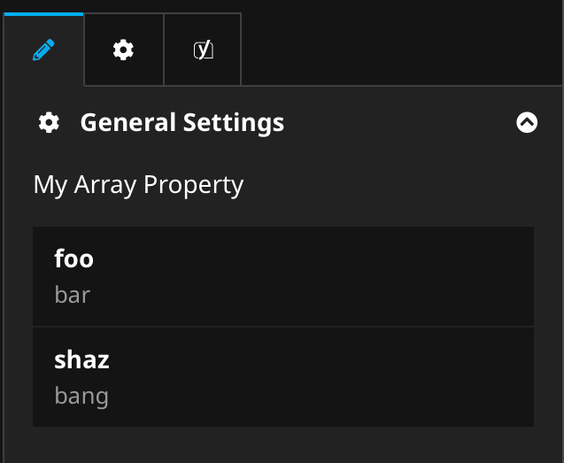

# UpAssist Neos Editors

Additional editors to be used in the Neos CMS.

## ArrayInfoEditor

### What it does
This editor shows rough array information in the same layout as the nodeView shows detailed information.

### When to use
When you store information to a node in the form of an array and want to show the details in the inspector.

### How to use
Add the editor to your configuration:

```yaml
   properties:
     myArrayProperty:
       type: array
       ui:
         ...
         inspector:
           ...
           editor: UpAssist.Neos.Editors/Inspector/Editors/ArrayInfoEditor
```

### Example

